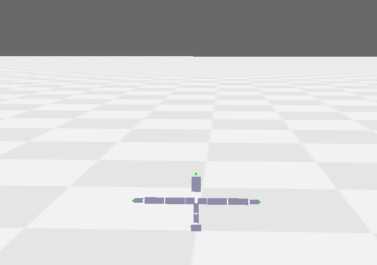
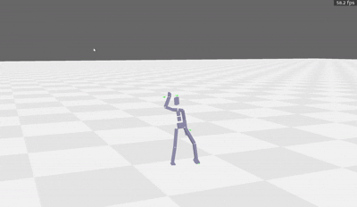
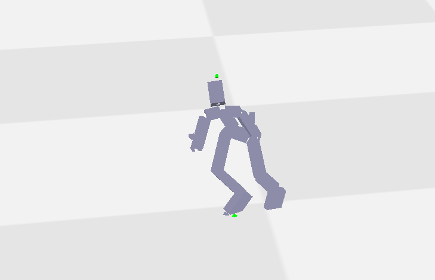
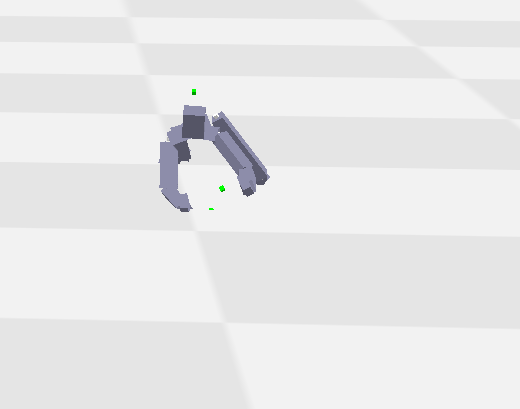
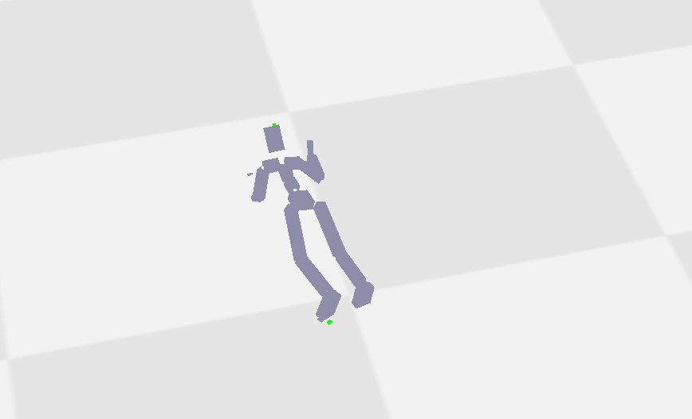
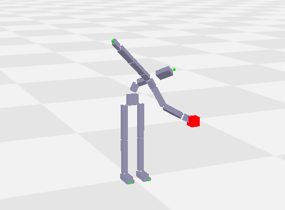
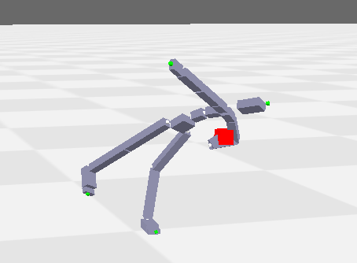
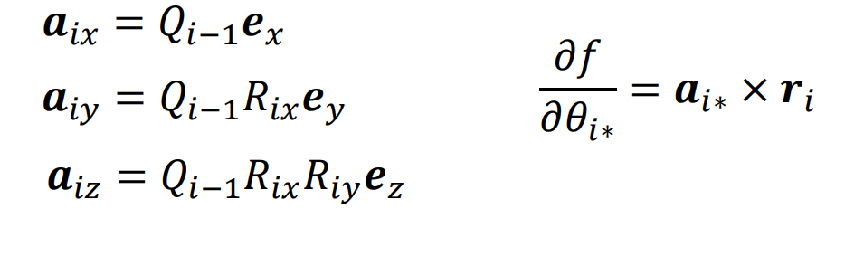
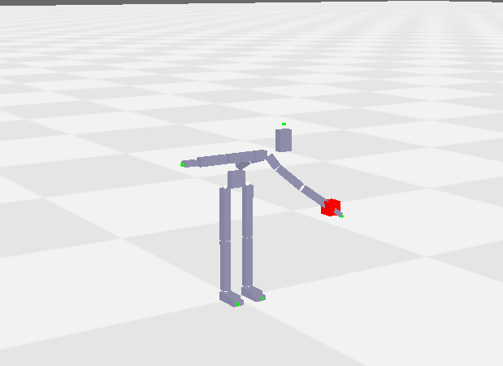

# 提交 Lab1
## 任务一
### Part 1: 读入BVH文件的人体结构

我们将joint结构视为树结构

整体思路是将每个joint视为一个point结点，这个结点是一个形如(name,depth,offset)的结构，depth表示在树中的深度，通过深度我们可以知道该joint的父joint：

#### 对于一个depth为i的结点，它的父关节对应的结点一定是离它最近的depth为i-1的结点


先用`readlines`函数读取BVH文件的所有行；遍历每一行，用`strip().startswith()`判断每一行的内容。

如果当前行以\{开头，说明进入树的下一层，通过设置depth，我们可以知道当前是树的第几层

如果以\}开头，说明这一层已经遍历结束，所以我们将depth减1

特别注意的是对于叶节点，其name为其父关节的name+_end

下图即为正确读取后的效果，如果叶节点读取不对，图中绿色圆点就不会在关节末端

<div align="center">
  
</div>

### Part 2: 前向运动学计算
主要就是利用FK公式来实现

<div align="center">

Q<sub>i</sub>=Q<sub>parent</sub>*R<sub>i</sub>

p<sub>i</sub>=p<sub>parent</sub>+Q<sub>parent</sub>*offset<sub>i</sub>
</div>

需要注意的是，在motion_data中，根节点有六个channel(前三个是position),叶结点没有

因此只需要从根节点开始，按照我们Part1中的顺序，利用公式更新

其中根节点Q=R,p是motion_data前三个数据,而叶节点Q=Q<sub>parent</sub>,p=p<sub>parent</sub>

效果如下
<div align="center">
  
</div>

### Part3:运动重定向

由于在作业说明中已经给出了rotation的信息，所以只需要我们读出motion_data之后，将这些变化直接乘到对应的joint上即可

截取三张图看看效果：
<div align="center">
  
</div>

<div align="center">
  
</div>

<div align="center">
  
</div>

另外，如果没有直接给出rotation信息，我们也可以根据两个bvh进行计算

## 任务二
### Part 1: 静态逆向运动学

#### 方法一：CCD IK算法
在用CCD算法实现时，从path的末端joint开始（不包括叶节点）到path的root，计算目标向量与当前向量的旋转轴、旋转角，并通过`from_rotvec`函数计算出rotation,更新以当前joint为根的路径上的joint的全局朝向和位置，最后当迭代结束以后，由更新好的全局朝向得到local rotation

另外，由于我们在`CCD`函数中并不是直接对输入的joint_positions和joint orientations 直接修改，所以最后要根据得到的rotation进行最后一次FK

需要注意的是：对于path穿过Root Joint(character的根关节)时,在最后一次FK之前需要先更新Root Joint的position和orientation

且正如我在代码中的注释：

>我们的chain的offset和上面计算的offset的方向是相反的 即chain：2->1 
> 我们计算的offset[1]表示l1的长度和方向 1->2
> 所以计算chain上的offset[2]= 原来的-offset[1] 长度相等 方向相反
> orientation：chain 6->4->1 原来 1->4->6 
> Q6=Q4\*R相对 Q4=Q6\*R逆
> 显然rotation是原来的逆 orientation变成后一个的orientation

在`init`函数中实现了这一点

效果如下：
<div align="center">
  
</div>

<div align="center">
  
</div>

#### 方法二：梯度下降 用Geometric Approach计算雅可比矩阵(效果有些奇怪)
>重点在于求雅可比矩阵,具体公式见下图：
<div align="center">
  
</div>


然而可惜的是，最终实现效果看上去有点奇怪，不知道是哪里出了问题，希望之后可以进一步调试

<div align="center">
  
</div>


### Part2: 逆向运动学+bvh [the "鸡头稳定器"]
利用part1的函数即可实现,只需要设定好目标position
```python
target_pose = np.array([relative_x + joint_positions[0][0], target_height, relative_z + joint_positions[0][2]])
```
效果如下：
<div style="text-align: center;">
  <video style="width: 45%; height: auto;" controls>
    <source src="images/task2_part2.mp4" type="video/mp4">
  </video>
</div>


