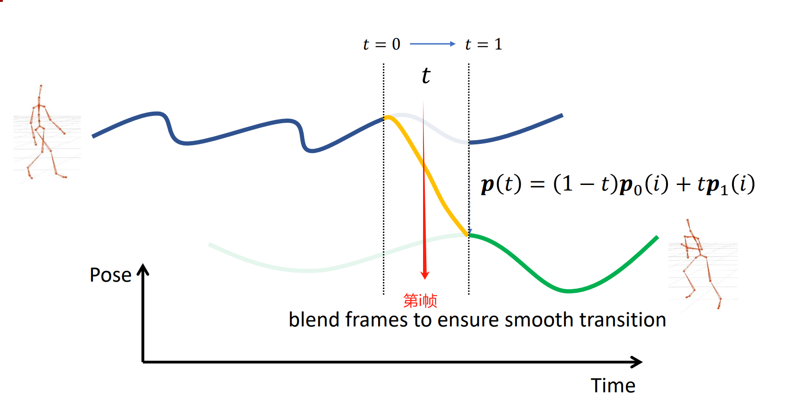
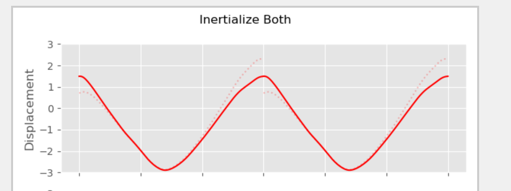
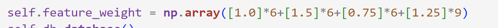
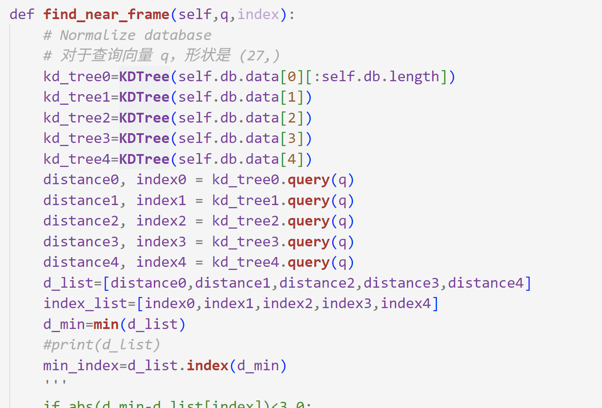
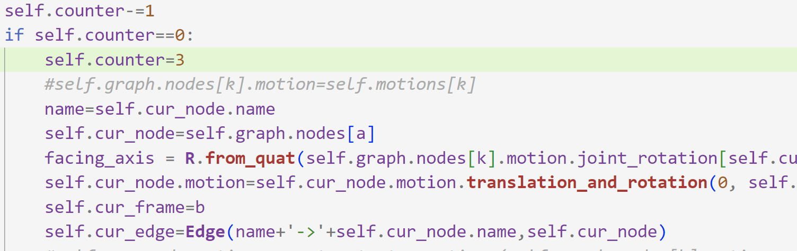

## PART 1

### 1.动作插值
#### a.首先根据提供的公式计算出blend_weight
由于已经先将动作对齐到(0,0)的Xoz位置，而这两个动作仅仅是向z方向前进，所以最后一帧z方向的坐标即为位移，帧数\*每一帧的时间`frame_time`即为时间，速度=位移/时间，得到速度v1和v2
利用$w=(v-v1)/(v2-v1)$计算出blend_weight
```python
 #初始z方向位置为0，用最后一帧计算的z位置/(帧数*frametime) 即为速度

    v1 = walk_forward.joint_position[-1,0,2] /(walk_forward.motion_length*walk_forward.frame_time)

    v2 = run_forward.joint_position[-1,0,2] / (run_forward.motion_length*run_forward.frame_time)

    blend_weight = (v-v1)/(v2-v1)

```
#### b.计算帧数

$n=\frac{w_1*v_1*n_1+w_2*v_2*n_2}{v}$
得到帧数

#### c.计算插值第i帧的position和rotation
<div align="center">
  
</div>
根据上图，要对时间做插值，首先将插值区间归一化到区间[0,1]上!
对于第i帧对应的位置t，需要用到动作1的index1帧和动作2的index2帧来进行blend
index1和index2如下：

```python
t=float(i/len(input_alpha))
index1=t*(n1-1)
index2=t*(n2-1)
```


然后，由于index1不一定是整数，所以先对index1向上、向下取整的这两帧做一个blend，来得到index1这一帧的动作；index2同理
**对于position使用 linear lerp，对于rotation，使用scipy库中的Slerp函数**
```python
position1=lerp(bvh_motion1.joint_position[k1][j],bvh_motion1.joint_position[k2][j],index1-k1)
position2=lerp(bvh_motion2.joint_position[m1][j],bvh_motion2.joint_position[m2][j],index2-m1)
rot1=R.from_quat([bvh_motion1.joint_rotation[k1][j],bvh_motion1.joint_rotation[k2][j]])
rot2=R.from_quat([bvh_motion2.joint_rotation[m1][j],bvh_motion2.joint_rotation[m2][j]])
time=[0,1]
slerp1=Slerp(time,rot1)
slerp2=Slerp(time,rot2)
rotation1=slerp1(index1-k1)
rotation2=slerp2(index2-m1)
```

再对得到的动作1的index1帧和动作2的index2帧的动作做一次blend
具体操作与上面类似

<u>在此过程中，不断将i向后推</u>


#### <font color="#ff0000">效果展示：</font>以v=1.5为例
<div style="text-align: center;">
  <video style="width: 60%; height: auto;" controls>
    <source src="1.mp4" type="video/mp4">
  </video>
</div>


### 2. 制作循环动画(使用inertialization）

#### a.根据inertialization的原理，首先计算diff
即第一帧与最后一帧的差异，对于position直接相减，而对于rotation，$R'=R^*R$
需要计算$R*$
```python
#首先计算开始帧与结束帧的差异

    rot_diff = (R.from_quat(rotations[-1]) * R.from_quat(rotations[0].copy()).inv()).as_rotvec()
    avel_diff = (avel[-1] - avel[0])
```
#### b.利用给出的临界阻尼作用Position和Rotation的函数，对diff做衰减

采用在两侧都做衰减的方式
<div align="center">
  
</div>
**对于第i帧的动作，分别计算position的offset和rotation的rot_offset**
**第i帧不只是受到头部diff1衰减的影响，还受到尾部diff2衰减的影响**

此外，首先还需要计算角速度和速度，以便应用阻尼弹簧函数来做衰减
```python
avel = quat_to_avel(rotations, 1/60)
avel_diff = (avel[-1] - avel[0])
```

计算diff1对应的衰减后的offset1：
ratio代表头部的贡献比例，1-ratio是尾部的贡献比例

从而对ratio\*diff做衰减得到offset1
```offset1 = decay_spring_implicit_damping_rot(ratio*rot_diff, (1-ratio)*avel_diff, half_life, i/60)```

<font color="#ff0000">offset2也是同理，只不过是将offset1的ratio替换为1-ratio</font>
然后总offset=offset1-offset2(以position为例)

**对于rotation的衰减也是同理**，只不过offset<font color="#ff0000">不是直接加减，而是相乘</font>
最后将这个offset应用到原来的动作上即可

#### <font color="#ff0000">效果展示</font>：

<div style="text-align: center;">
  <video style="width: 60%; height: auto;" controls>
    <source src="2.mp4" type="video/mp4">
  </video>
</div>


### 3.动作拼接（使用inertialization）

#### 1.首先找到bvh_motion2中离motion1的mix_frame1最接近的一帧
见find_best_match_frame函数，其中position diff的权重为0.6，rotation_diff的权重为0.4
找到diff最小的那一帧
<u>事实上，也可以直接尝试不同的mix_frame2，观察哪个效果比较好</u>
#### 2.进行bvh_motion2和bvh_motion1的对齐
利用`translation_and_rotation`函数将bvh_motion2的mix_frame2帧的position、xz朝向分别对齐到bvh_motion1的mix_frame1帧
#### 3.计算动作1的mix_frame1帧与动作2的mix_frame2帧之间的差异
同上文原理一样，计算位置、旋转、速度、角速度的diff
```python
avel1=quat_to_avel(rotations1, 1/60)
avel2=quat_to_avel(rotations2,1/60)
rot_diff = (R.from_quat(rotations1[-1]) * R.from_quat(rotations2[0].copy()).inv()).as_rotvec()
avel_diff = (avel1[-1] - avel2[0])
pos_diff = res1.joint_position[-1] - res2.joint_position[0]
vel1 = res1.joint_position[-1] - res1.joint_position[-2]
vel2 = res2.joint_position[1] -res2.joint_position[0]
vel_diff = (vel1 - vel2)/60
```
#### 4.将diff衰减后加到动作2上
利用阻尼弹簧函数得到衰减后的diff，将衰减后的diff加到motion2上

#### <font color="#ff0000">效果展示：</font>
如果希望从走到跑这一加速过程比较快，`half_life`要设置的比较小
像下面这样(**half_life=0.27**)

<div style="text-align: center;">
  <video style="width: 60%; height: auto;" controls>
    <source src="3.mp4" type="video/mp4">
  </video>
</div>

如果希望从走到跑是一个慢慢变化的过程，则将half_life适当调大

==另外发现直接选取`mix_frame2=20`可以得到不错的效果（虽然有脚滑），如下：==

<div style="text-align: center;">
  <video style="width: 60%; height: auto;" controls>
    <source src="4.mp4" type="video/mp4">
  </video>
</div>


## PART 2

### 参考https://github.com/orangeduck/Motion-Matching
用根节点近似作为`Simulation Bone`
### 1.构建database

**对于所有bvh的每一帧构建一个27维特征向量，这27维分别是：**
0-6：未来第20，40，60帧相对于第0帧根节点在局部坐标系中的位移(只需要x、z方向) 
6-12：未来第20，40，60帧相对于第0帧根节点在局部坐标系中的朝向(只需要x、z方向) 
12-18：左脚、右脚在局部坐标系中的位置
18-27：根结点、左脚、右脚在局部坐标系中的速度
用一下三个函数实现：
>compute_trajectory_position_feature
>compute_trajectory_direction_feature
>compute_other_feature

读取五个bvh文件的motion data,对于每一帧构建出相应的feature_vector
data是一个五元素的list，list[i]表示第i个bvh的所有feature_vectors
<font color="#ff0000">此外，应对特征向量进行归一化</font>
<font color="#ff0000">对每一维，求均值和方差，进行归一化处理</font>


### 2.对于cur_frame，得到cur_frame对应的特征向量 即query
0-6,6-12用以下代码实现：
```python
query[0:2]=R.from_quat(self.cur_root_rot).inv().apply(desired_pos_list[1]-self.cur_root_pos)[[0,2]]

query[2:4]=R.from_quat(self.cur_root_rot).inv().apply(desired_pos_list[2]-self.cur_root_pos)[[0,2]]

query[4:6]=R.from_quat(self.cur_root_rot).inv().apply(desired_pos_list[3]-self.cur_root_pos)[[0,2]]

        query[6:8]=R.from_quat(self.cur_root_rot).inv().apply(R.from_quat(desired_rot_list[1]).apply(np.array([0.,0.,1.])))[[0,2]]

        query[8:10]=R.from_quat(self.cur_root_rot).inv().apply(R.from_quat(desired_rot_list[2]).apply(np.array([0.,0.,1.])))[[0,2]]

        query[10:12]=R.from_quat(self.cur_root_rot).inv().apply(R.from_quat(desired_rot_list[3]).apply(np.array([0.,0.,1.])))[[0,2]]
```
**12-27直接复制database中相应帧的向量即可**

### 3.在database中搜索离query最近的一帧next_frame
利用scipy库中的**KDTree**函数，搜索比较快速
同时需要注意的是，在搜索之前为每一维**设置了合适的权重**，使得计算距离不是简单的欧几里得距离
权重设置如下：
<div align="center">
  
</div>

同时需要注意的是，应该得到最近的一帧所在的bvh和这一帧在相应的bvh中的index
因此，分别建立五个KDTree

<div align="center">
  
</div>

尝试改进的方法是：在手柄方向不变的情况下，优先从第0个tree(也就是walk.bvh对应的tree中查找)

### 4.找到之后进行切换
这里我做了两个变化：
### a.找到next-frame之后，若要切换node,不是立即切换node
这是为了避免来回在两个node摆动
当有三次发现要切换node之后才真正切换

如下，利用self.counter实现
<div align="center">
  
</div>


### b.将walk.bvh设置为循环动作
利用task1中的bulid_loop_motion即可


## <font color="#ff0000">效果展示：</font>
#### 1.180度 spin
<div style="text-align: center;">
  <video style="width: 60%; height: auto;" controls>
    <source src="5.mp4" type="video/mp4">
  </video>
</div>

#### 2.turn left and turn right
<div style="text-align: center;">
  <video style="width: 60%; height: auto;" controls>
    <source src="6.mp4" type="video/mp4">
  </video>
</div>

<div style="text-align: center;">
  <video style="width: 60%; height: auto;" controls>
    <source src="7.mp4" type="video/mp4">
  </video>
</div>
