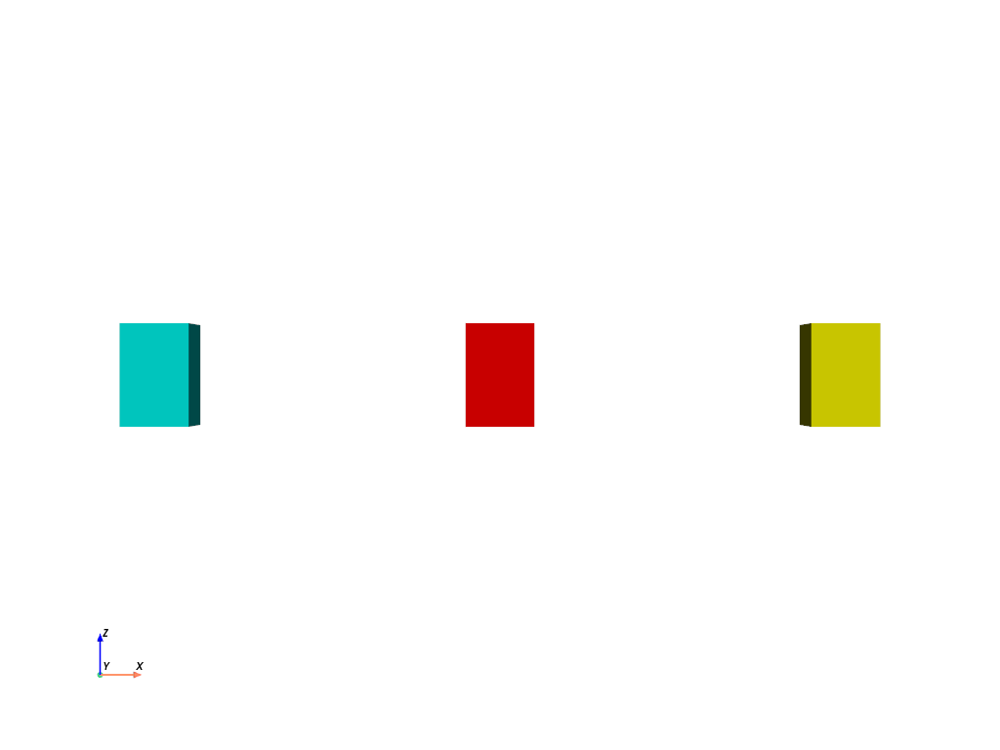
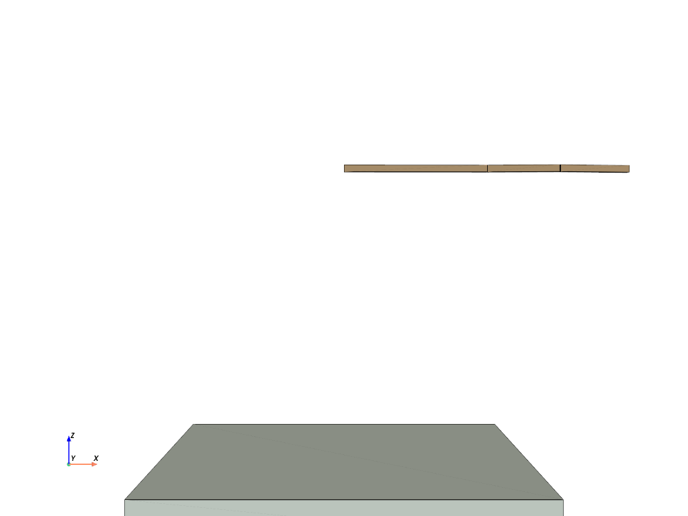
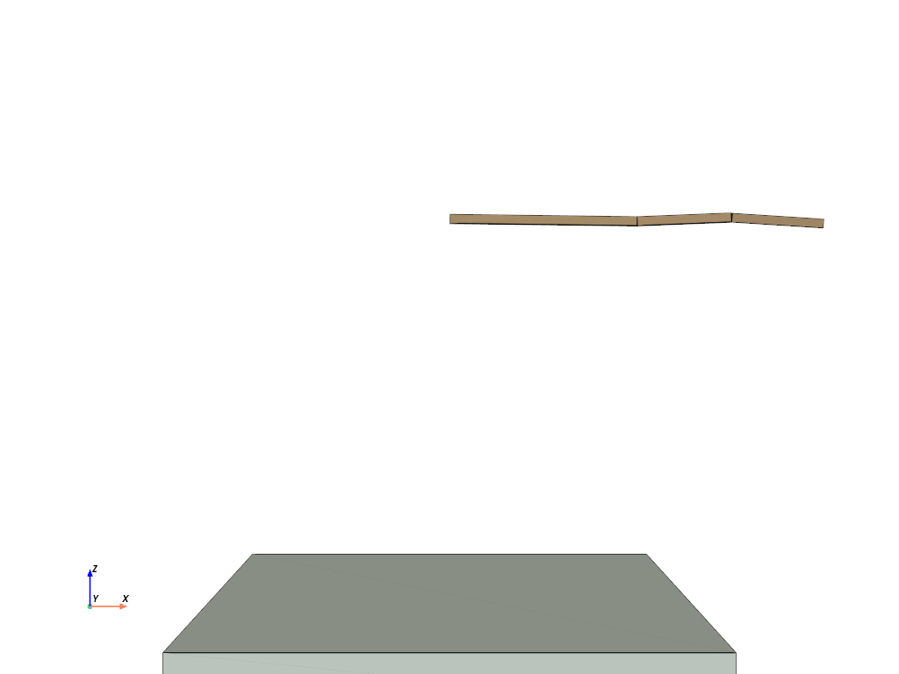
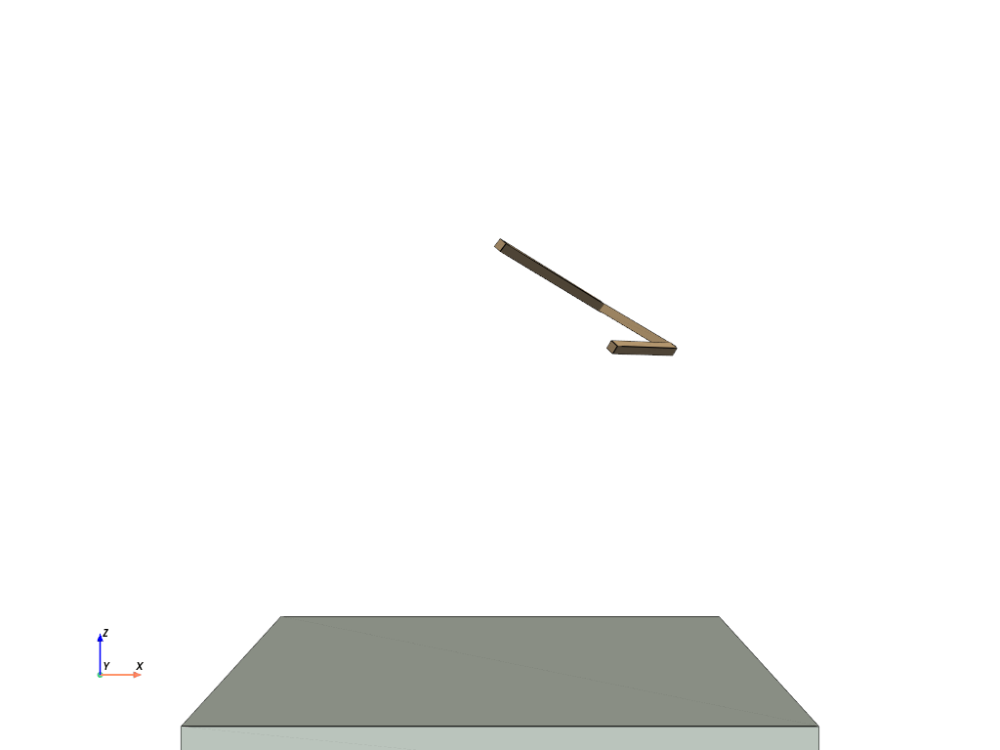

# MoCCA 2025 Lab 3

在本次作业中，你将从零开始实现一个基本的铰接刚体仿真器，并在仿真中控制一个机械臂完成几个简单任务。

--------------------------------------------
## 任务零  环境配置 （不赋分）
--------------------------------------------

建议使用conda等建立新的虚拟环境
```bash
conda create -n mocca2025 python=3.12
conda activate mocca2025
pip install -r requirements.txt
```
如果下载过慢可使用清华镜像源安装 
* https://mirrors.tuna.tsinghua.edu.cn/help/anaconda/
* https://mirrors.tuna.tsinghua.edu.cn/help/pypi/

> 本作业只允许使用出现在 `requirements.txt` 中的库（包括 `numpy`, `scipy`, `pyvista` 等）以及其依赖的库。评测时也以此为准。作业文件中请不要import除此之外的库。
>
> 旋转矩阵相关的运算可以考虑使用 `scipy` 中的 `scipy.spatial.transform.Rotation`，需要使用的同学可以参考其[文档](https://docs.scipy.org/doc/scipy/reference/generated/scipy.spatial.transform.Rotation.html)
> 
> `requirements.txt` 中包括了一个四元数库 `numpy-quaternion` ，需要用到的同学可以参考其[文档 [https://quaternion.readthedocs.io]](https://quaternion.readthedocs.io)。


完成后可以运行`problem_1.py`，你将会看到三个不同颜色的立方体出现在屏幕中央。
<p align=center>
 
</p>

> * 本框架使用 pyvista 作为可视化组件。由于框架限制，运行时关闭窗口可能不能正常关闭程序，建议在控制台用 `ctrl+C` 来中止程序，或者使用命令行参数 `--frames` 指定一个较少的总帧数
> * 在可视化窗口中可以用鼠标调整视角
> * 使用命令行参数 `python problem_x.py --video video_name.mp4` 可以自动输出视频

--------------------------------------------
## 任务一  铰接刚体仿真 (60分)
--------------------------------------------

在第一个任务中，你需要依次完成三个子任务，完成一个基本的铰接刚体仿真器，分别为：
* 问题1：自由刚体的仿真
* 问题2：带关节约束刚体的仿真
* 问题3：特殊关节约束（hinge）的实现

### 问题1 自由刚体的仿真 (15分)

在本问题中，需要完成两个子任务。你可以运行 `python problem_1.py` 来运行和检查当前的结果。

在 `problem_1.py` 中，我们首先建立了三个互相独立的刚体，设定其各自的质量、转动惯量、位置、朝向、速度、角速度等信息，并在其中一个刚体上施加了周期性的力和力矩，你需要补充 `answer_1.py` 中的关键代码，计算三个刚体各自的运动。

在初始状态下，你将会看到三个不同颜色的立方体出现在屏幕中央，且静止不动。
<p align=center>
 
</p>

#### 1. 刚体位置和朝向的更新
在这个子问题中，你需要完成 `answer_1.py` 中的 `integration` 函数。该函数需要根据当前每个刚体的速度、角速度，更新刚体的位置和朝向。具体的输入和输出要求参见函数开头的注释。需要注意输入和输出的 `np.array` 的形状必须满足注释要求。

> * 在本 Lab 中，你会注意到大部分函数的输入输出将多个刚体的状态信息表示为一个多维 `np.ndarray` 对象，其中第 0 维代表不同刚体。
> * 你可以用 for 循环对每个刚体单独处理，但更高效的方式是使用 `numpy` 的向量化操作。建议阅读 `numpy` 的文档以及相关例程了解向量化操作的方法

完成本函数后，运行 `python problem_1.py` 将得到类似如下的结果
<p align=center>
 
</p>

> 注意：在对旋转计算积分后，需要对结果进行正交化。如果你直接对旋转矩阵进行积分，但没有对结果正交化，结果可能会如下
<p align=center>
 
</p>

> 注意中间方块的大小和形状变化。这里我们为了说明问题，使用了较大的时间步长 ( h=0.016s ) ，你的实验中 ( 默认时间步长为 h=0.001s ) 可能不会出现如此剧烈的变化，但仍然需要注意这一问题。


#### 2. 刚体前向动力学计算
在上面的问题中，我们实际上已经在右边的黄色立方体上施加了一组随时间变化的力和力矩，但是这些力和力矩还没有实际起作用。在这个子问题中，你需要完成 `answer_1.py` 中的 `forward_dynamics` 函数，计算刚体速度、角速度在给定力和力矩作用下，到下一时间步时的值。

> * 你需要使用刚体的牛顿-欧拉 (Newton-Euler) 方程
> $$ m\frac{v_{n+1}-v_{n}}{h} = f$$  
> $$ I\frac{\omega_{n+1}-\omega_{n}}{h} + \omega\times{}Iw = \tau$$
> * 刚体的质量和*初始*转动惯量的逆是计算中常用的量，我们在 `problem_1.py` 中预先计算了这些量，并作为参数传入 `forward_dynamics` ，你可以直接使用，也可以根据需要重新计算
> * 思考：刚体旋转时候，它的转动惯量及其逆该如何变化？

最终效果大致如下：
<p align=center>
 
</p>

> 如果你仔细观察，会发现上面视频中红色立方体的旋转方式与子问题 1. 结果视频中的旋转方式不一致。在本问题结果中，立方体的旋转轴和转速在不断变化。这是因为在本题设定中，立方体的转动惯量在三个主轴方向上大小不同，而立方体的初始角速度与主轴方向不一致，导致转动过程中能量在几个主轴间不断转换。更极端的情况可以参考 “贾尼别科夫效应” [https://www.bilibili.com/video/BV1pJ411u7nP]

> 为了验证你的实现是否正确，你可以在运行时加上 `--debug-mode` 参数，在仿真时同步输出中间红色刚体的角动量。由于该刚体未受到外力，因此角动量守恒。对于本例，参考的输出如下：
```
python problem_1.py --debug-mode
    ................
    angular momentum: [0.30002032 0.40003009 0.39998071]
    angular momentum: [0.30003805 0.40006097 0.39996142]
    ................
    angular momentum: [0.29930011 0.40257856 0.40129941]
    angular momentum: [0.29929471 0.40256954 0.40134029]
    ................
    angular momentum: [0.30061077 0.40542679 0.40388855]
    angular momentum: [0.30059976 0.40546479 0.40388159]
    ................
```

> 其中转动惯量的三个分量大致在 `[0.30, 0.40, 0.40]` 附近浮动。不过由于对旋转数值积分存在误差，这些分量不会完全恒定。减小时间步长 `h` (当前为 0.001s)，可以显著减小偏离误差。

> 如果你的实现结果中，上述角动量输出有明显变化，可能的原因包括：
> * `forward_dynamics` 中没有正确计算牛顿-欧拉方程，例如丢掉了 $w\times{}Iw$ 项，或者没有正确计算旋转之后的转动惯量
> * `integration` 中没有正确的对旋转表示正交化
> * 其他 bug ...

  
### 问题2 铰接刚体的仿真 (40分)
在本问题中，我们将通过三个子任务来实现带关节约束的铰接刚体系统仿真。你可以运行 `python problem_2.py` 来检查结果。

在 `problem_2.py` 中，我们创建了一个三摆系统，其有三个刚体和三个关节构成，其中第一个关节（根关节）固定在原点。你需要完成 `answer_2.py` 中的缺失代码，实现如下的效果：
<p align=center>
 
</p>


#### 1. 创建关节对象
本问题的主要目的是熟悉关节的定义，以及关节的关键信息。你需要完成 `answer_2.py` 中 `create_joint` 函数。该函数框架已经基本写好，你需要完成对 `from_bodyA` 和 `from_bodyB` 参数的计算，并利用这些结果创建 `Joint` 对象。

> 参见 `joints.py` 中 `Joint` 类的定义

该函数在 `triple_pendulum.py` 中被调用，用于创建三摆的三个关节。


#### 2. 计算球窝关节约束方程
在本问题中，你需要完成 `answer_2.py` 中 `ball_Jacobian` 函数。该函数的目的是对每个关节计算其约束雅可比矩阵和右端项。这里我们仅考虑关节的位置约束，对应球窝关节 (ball-and-socket joint)。

##### 2.1 计算Jacobian 矩阵
> 关节的位置约束为：
> $$ x_A + R_A r_A = x_{jnt} = x_B + R_B r_B$$
> 对应速度约束为：
> $$ v_A + \omega_A \times R_A r_A = v_{jnt} = v_B + \omega_B \times R_B r_B$$
> 写成矩阵形式为：
> $$\left[I \quad  -[R_A r_A]_{\times} \quad -I \quad [R_B r_B]_{\times} \right] \left[\begin{matrix} v_A \\ \omega_A \\ v_B \\ \omega_B \end{matrix} \right] = b_{rhs}$$
> 具体推导可以参考课程 PPT

你需要实现对 $J= [I \  -[R_A r_A]_{\times} \quad -I \quad [R_B r_B]_{\times} ]$ 矩阵的计算。对每一个关节来说，这是一个 $3 \times 12$ 的矩阵，其中前 6 列对应 `bodyA` ，后 6 列对应 `bodyB` 。


##### 2.2 计算约束方程右端项
上述公式的右端项 $b_{rhs}$ 在运动方程可以精确求解的情况下应该为 0 。但是，因为数值积分总是存在误差，如果直接使用 $b_{rhs}=0$，你可能会得到类似下面的结果：
<p align=center>
 
</p>

可以看到这里关节出现了明显的错位。注意这里我们使用了较大的时间步长 (h=0.016s) 来展示问题，在默认时间步长 (h=0.001s) 下，实际的错位不会如此显著，但在较长时间仿真后，同样会出现明显的错位，参见 [此视频 (images/problem2_no_rhs_0.001.gif)](images/problem2_no_rhs_0.001.gif)。

为此，你需要计算 $b_{rhs}$ 来修正误差。具体而言，在数学上，出现错位是因为从关节连接的两个刚体看到的关节位置发生了偏移，即：
$$ v_{jnt}^A = v_A + \omega_A \times R_A r_A $$ 
$$ v_{jnt}^B = v_B + \omega_B \times R_B r_B $$

且 $\Delta = v_{jnt}^A - v_{jnt}^B\neq 0$ 。修正项的目标是用一段时间修正这个偏差，即 $b_{rhs}=\alpha\Delta$ 。具体推导可参见 PPT

> 建议在完成 lab 时，先暂时设 $b_{rhs}=0$ ，待完成下面的子问题 3. 后再来补充对 $b_{rhs}$ 的计算，降低调 bug 的难度。


#### 3. 带约束的刚体前向动力学计算

在本问题中，你需要完成 `answer_2.py` 中 `forward_dynamics_with_constraints` 函数。在该函数中，我们将完成铰接刚体仿真器的最核心计算，即构建带约束的牛顿-欧拉方程，并求解。

在 `forward_dynamics_with_constraints` 中，我们已经为你搭好了一个实现框架。你可以基于这个框架补充缺少的内容，也可以删掉这个框架，在 `####### 你的回答 #######` 中填写你自己的实现。

> * 为了实现方便，这个框架本身基于稠密矩阵的计算，效率较低，在刚体和关节较少时速度尚可接受，但是如果需要仿真大量刚体和关节，需要考虑运动方程中各矩阵的稀疏性。
> * 你可能注意到，在本问题中，我们实际上创建了 4 个刚体，其中最后一个刚体是一个逆质量为 0 （等价质量为无穷大）的静态刚体，代表整个空间。这种设定支持我们用统一的刚体方法处理所有约束，包括固定在原点的根关节约束。注意：根关节的 `bodyA=-1` ，在 `numpy` 的下标约定下，它指向的是最后一个刚体，即该静态刚体。

> 为了验证你的实现是否正确，你可以在运行时加上 `--debug-mode` 参数。在该参数下，我们会
> * 创建一个在无重力环境下、无根关节的铰接刚体系统，
> * 将仿真步长设置为默认的 1/10，即 `h=0.0001`
> * 在仿真时同步输出整个系统的角动量。
>
> 由于该刚体未受到外力，因此角动量守恒。对于本例，参考的输出如下：
```
python problem_2.py --debug-mode
    ................
    angular momentum: [ 1.499530  3.000782  5.999689]
    angular momentum: [ 1.499557  3.001003  5.999610]
    angular momentum: [ 1.499521  3.001225  5.999534]
    ................
    angular momentum: [ 1.498718  3.007772  6.002392]
    angular momentum: [ 1.498713  3.007755  6.002454]
    angular momentum: [ 1.498714  3.007743  6.002513]
    ................
```

> 其中转动惯量的三个分量大致在 `[1.50, 3.00, 6.00]` 附近浮动。运行过程如下：
<p align=center>
 
</p>

> 如果你的实现结果中，上述角动量输出有明显变化，可能的原因包括：
  * 没有正确计算牛顿-欧拉方程，例如丢掉了 $w\times{}Iw$ 项，或者没有正确计算旋转之后的转动惯量
  * `ball_Jacobian` 中计算有误
  * 构建运动方程矩阵时，矩阵块的填充位置不正确
  * 约束方程的 `A` `b` 矩阵计算公式出错
  * 没有注意 `numpy` `array`赋值/复制规律，导致意外修改了原始 `array`
  * 其他 bug ...

### 问题3 Hinge关节约束的实现 (5分)
在本问题中，我们将问题2的基础上，增加hinge关节约束。你需要完成 `answer_3.py` 中的 `hinge_Jacobian` 函数。Hinge关节是一个单自由度的关节，只能绕着指定旋转轴旋转。等价地，关节连接的两个刚体的相对角速度，应当尽在该旋转轴的方向非零，其他方向上应该是 0 ，思考一下该如何实现。

在这一问题中，你需要实现 Hinge 约束的 Jacobian 矩阵，以及对应的右端项。你可以运行 `python problem_3.py` 来检查结果。
<p align=center>
 
</p>

> 类似问题2，为了验证你的实现是否正确，你可以在运行时加上 `--debug-mode` 参数。在该参数下，我们会
> * 创建一个在无重力环境下、无根关节的铰接刚体系统，并添加 Hinge 关节
> * 将仿真步长设置为默认的 1/10，即 `h=0.0001`
> * 在仿真时同步输出整个系统的角动量。
> 
> 由于该刚体未受到外力，因此角动量守恒。对于本例，参考的输出如下：
```
python problem_3.py --debug-mode
    ................
    angular momentum: [ 1.498635  3.001666  5.999304]
    angular momentum: [ 1.498650  3.001679  5.999294]
    angular momentum: [ 1.498664  3.001695  5.999285]
    ................
    angular momentum: [ 1.498320  3.001958  5.999310]
    angular momentum: [ 1.498301  3.001949  5.999314]
    angular momentum: [ 1.498283  3.001939  5.999319]
    ................
```

> 其中转动惯量的三个分量大致在 `[1.50, 3.00, 6.00]` 附近浮动。运行过程如下：
<p align=center>
 
</p>

> 注意两个关节的旋转轴不同


--------------------------------------------
## 任务二  机械臂控制 (40分)
--------------------------------------------
在第二个任务中，你需要依次完成三个子任务，实现对机械臂姿势和末端点的控制：
* 问题4：基于重力补偿的姿势控制
* 问题5：基于 PD 控制的姿势控制
* 问题6：末端点轨迹跟踪

本任务需要使用任务一中问题1、2构建的仿真器来进行，请确保已经完成任务一的1、2子任务。

> 在本任务中，我们设定刚体 0，1，2 和关节 0，1，2 依次构成父子关系，其中 0 为根关节。在每个关节的定义中，`bodyA` 是父刚体，`bodyB` 是子刚体。在应用关节 `j` 的力矩 `joint_torques[j]` 时，施加在 `bodyB` 上的力矩为 `joint_torques[j]`， `bodyA` 获得的力矩为 `-joint_torques[j]`。
> 
> 参见 `joints.py` 中 `joint_torque_converter` 函数


### 问题4 基于重力补偿的姿势控制 (12分)

在本问题中，你需要完成 `answer_4.py` 中 `gravity_compensation` 函数。该函数根据当前机械臂各刚体的状态信息，计算一组关节力矩，使机械臂能够保持当前的姿势静止不动。

可以通过牛顿-欧拉迭代求解逆动力学计算关节力矩，也可以用过 Jacobian Transpose 方法计算。具体推导参见 PPT 。

你可以运行 `python problem_4.py` 来检查结果。如果实现正确，运行结果类似于：
<p align=center>
 
</p>

这里系统每隔一段时间会随机设定机械臂的姿势，在重力补偿梨俱下，机械臂能够稳定的静止在给出的姿势上。

> 如果你的实现无法保持机械臂静止，可以检查：
> * 是否实现正确？每个关节需要对其所有的子孙关节进行重力补偿，越接近根节点，补偿得越多。
> * 任务一中的仿真器是否实现正确？特别是通过 `debug-mode` 检查角动量是否接近守恒。重力补偿可以与上面仿真器的实现互相验证。

### 问题5 基于 PD 控制的姿势控制 (13分)
在本问题中，你需要完成 `answer_5.py` 中 `PD_control` 函数。该函数根据当前机械臂各刚体的状态信息，以及一组目标关节旋转，计算一组关节力矩，使机械臂能够跟踪目标关节姿势。

> PD 控制的表达式为
> $$\tau=k_p(q_{target} - q_{current}) - k_d \dot{q}_{current}$$
> 思考：在 $q$ 代表三维旋转的时候，上面公式中 $q_{target} - q_{current}$ 该如何计算？$\dot{q}$ 代表哪一个量？
>
> > 在这里 $\dot{q}$ 表示的应该是当前的关节旋转速度，也即关节连接的两个刚体的相对角速度
> 
> > $q_{target} - q_{current}$ 的一种可能的计算方法是：
> > $$R_{\delta}=R_{target}R_{current}^T$$
> > 其中 $R_{target}$ 和 $R_{current}$ 为 **关节** 的目标和当前旋转。最后将 $R_{\delta}$ 转换为轴角表示（也即该旋转的 Exponential Map），记为 $\delta{}q$，则可认为 $\delta{}q := q_{target} - q_{current}$
>
> > 注意最终计算得到的关节力矩需要表示在世界坐标系下。思考：上面计算得到的 $R_{\delta}$ 是在哪个坐标系下？

你可以运行 `python problem_5.py` 来检查结果。如果实现正确，运行结果将类似于：
<p align=center>
 
</p>

注意与 问题5 不同，这里机械臂不会保持静止，而是在目标姿势附近摆动

> 如果你的实现结果与上面视频差别较大，或仿真爆炸，可以检查：
> * 关节力矩是否已经转换到世界坐标系？
> * $\delta{}q$ 与 $\dot{q}$ 是否是同一坐标系下表示？
> * 计算当前关节旋转以及转速时，是否父刚体和子刚体的顺序出错？

### 问题6 末端点轨迹跟踪 (15分)

在本问题中，你需要完成 `answer_6.py` 中 `end_effector_track_control` 函数。该函数根据当前机械臂各刚体的状态信息，以及末端点的目标位置，计算一组关节力矩，使得机械臂能够准确跟踪给定的末端点轨迹。

> `end_effector_track_control` 函数的注释中提供了几种实现思路。

你可以运行 `python problem_6.py` 来检查结果。下面是一种可能的实现效果：
<p align=center>
 
</p>


--------------------------------------------
## 提交
--------------------------------------------

需要提交的文件是 `answer_1.py`, `answer_2.py`, `answer_3.py`, `answer_4.py`, `answer_5.py`，`answer_6.py`，各问题结果的视频 （可以使用 `python problem_x.py --video video_name.mp4` 进行录制）， 以及一份你实现过程和最终实现结果的报告。最终上交时打包成zip格式，注意在你上交的每一份文件上都写好你的姓名学号。