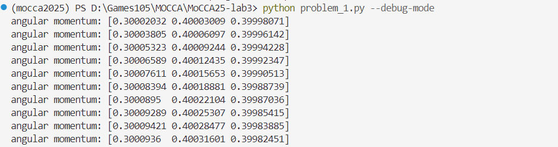
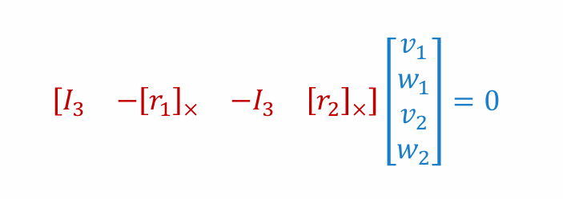
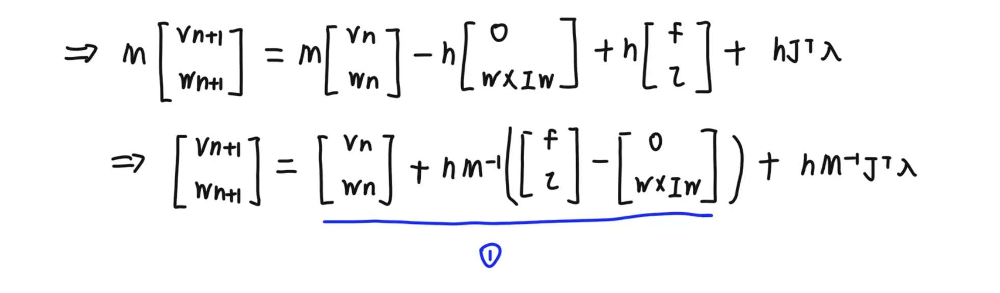
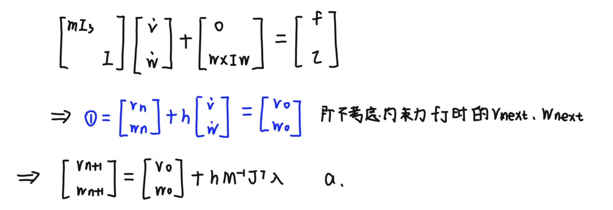
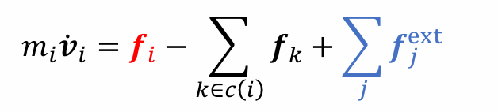
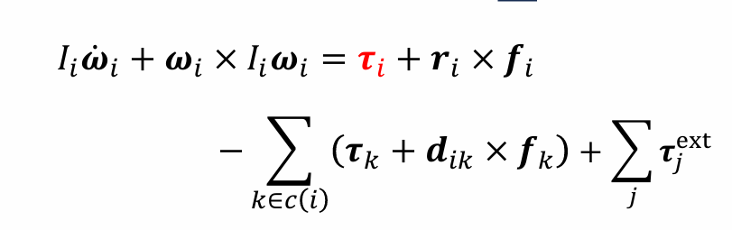
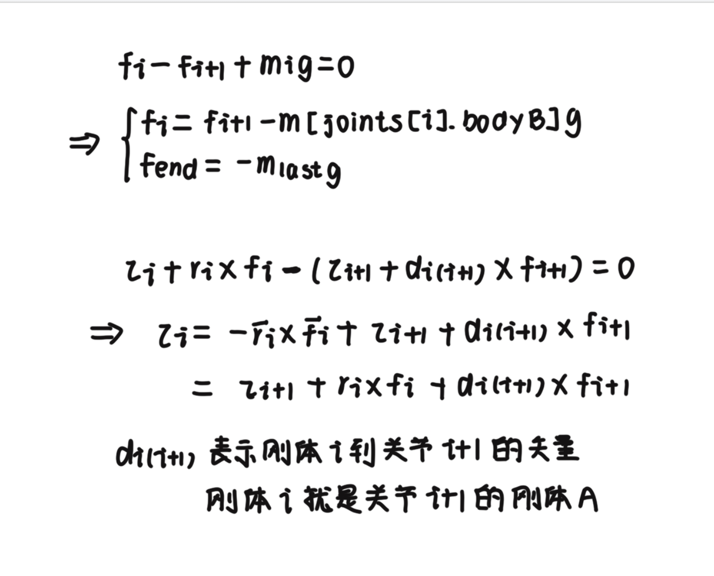
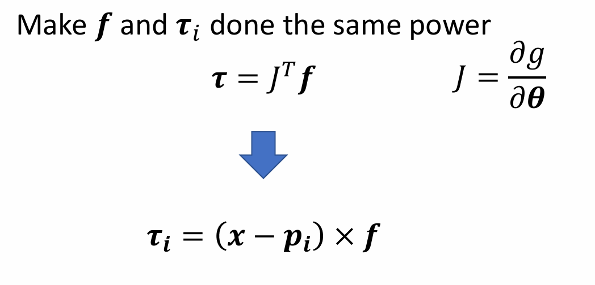

*学号：2300013147*
*姓名：梁书怡*
## answer1
### 1.自由刚体的仿真
#### 1.1. 刚体位置和朝向的更新

$x'=x+hv$
$R'=R+h·[w]_\times R$

其中$[w]_\times=\begin{matrix} [0 & -w_z & w_y \\ w_z & 0 & -w_x \\ -w_y & w_x & 0] \end{matrix}$

利用这两个公式即可进行更新

**注意要对最后得到的R进行正交化**  <u>使用SVD分解</u> 如下

```python
u, _, vh = np.linalg.svd(R_temp)
R_next[i] = u @ vh
```

#### 1.2. 刚体前向动力学计算

**对==转动惯量的更新**==
$I_{new}=RIR^T$
注意这里的$I_{new}$不能写回原来的$I$，即$I$一直是初始状态的I
这是因为这里的$R$已经代表的是全局朝向，而不是从一个状态到另一个状态的旋转

计算加速度：
```python
a=inv_m[i]*f[i]
```

==<font color="#c0504d"><u>计算角速度</u></font>==
根据$\tau=I'w+Iw'$   '表示对t求导
其中$I'w=w \times Iw$
由此可知
$w'=I^{-1}(\tau-w \times Iw)$
```python
Iw = I_[i] @ w[i]
dI_dt_w=np.cross(w[i],Iw)
w_alpha=inv_I_[i]@(tau[i]-dI_dt_w)
```

### <font color="#ff0000">实现效果</font>
<div align="center">
  
</div>
<div style="text-align: center;">
  <video style="width: 60%; height: auto;" controls>
    <source src="problem1.mp4" type="video/mp4">
  </video>
</div>
## answer2

利用给出的框架

### 计算ball_joint的jacobian
根据ppt上的公式可以计算
<div align="center">
  
</div>
**但这里的r1和r2是世界坐标系下的，因而需要==将刚体的朝向作用在关节在刚体坐标系的位置上==才能进一步得到**

计算修正项rhs：<u>计算关节在bodyA bodyB上的速度 作差 乘上alpha(我用的是0.25)作为修正</u>
```python
v_jnt_A = v[bodyA] + np.cross(w[bodyA], R[bodyA] @ jnt.from_bodyA)
v_jnt_B = v[bodyB] + np.cross(w[bodyB], R[bodyB] @ jnt.from_bodyB)
alpha = 0.25
delta_v=v_jnt_B  - v_jnt_A
rhs[i] = alpha * delta_v
```

### forward_dynamics_with_constraints

**对转动惯量的更新和answer1一样**
### 1.先计算M=$diag\{m_1I,I_1,m_2I,I_2...\}$
```python
for i in range(num_bodies):
	blocks1.append(m[i]*np.eye(3))
	blocks2.append(inv_m[i]*np.eye(3))
	blocks1.append(I_world[i])
	blocks2.append(inv_I_world[i])
M=scipy.linalg.block_diag(*blocks1)
inv_M=scipy.linalg.block_diag(*blocks2)
```

### 2.利用answer1的函数计算v0,w0
这里有一个==公式的推导==：
<div align="center">
  
</div>
<div align="center">
  
</div>

可见v0,w0即为answer1中`forward_dynamics`函数得到的结果

### 3.构造Jacobian矩阵
Jacobian矩阵有$numbodies*6$列，这是因为每个body有对应的v和w，分别占三列
```python
for i in range(num_joints):
	body1=joints[i].bodyA
	body2=joints[i].bodyB
	if body1==-1:
		body1=num_bodies-1
	if body2 == -1:
		body2=num_bodies-1
	J[3*i:3*i+3,body1*6:body1*6+6]=J_ball[i][:,0:6]
	J[3*i:3*i+3,body2*6:body2*6+6]=J_ball[i][:,6:12]
```

### 4-5.利用公式计算A和b，求解$\lambda$
```python
A=h*(J@inv_M@np.transpose(J)) #A是9*9矩阵 J是9*24矩阵 vw是24*1
b = rhs - J@vw
```

### 6.更新vnext,wnext

$[v_{next}, w_{next}] = [v0, w0] + h * M^{-1} * J^T * \lambda$

### <font color="#ff0000">实现效果</font>
<div align="center">
  
</div>
<div style="text-align: center;">
  <video style="width: 60%; height: auto;" controls>
    <source src="problem2.mp4" type="video/mp4">
  </video>
</div>


## answer3

对于hinge joint,在原有基础上增加，==角速度在与转轴正交的两个方向上的分量为0==
从而得到以下约束：

$(w_A-w_B) · n_1^T=0$
$(w_A-w_B) · n_2^T=0$
n1,n2即与旋转轴正交的两个方向

==对应的J应该是==
$\begin{matrix} [0 & -n_1 & 0 & n_1 \\ 0 & -n_2 & 0 & n_2 ] \end{matrix}$

求n1,n2:
```python
a_world = R[jnt.bodyA] @ jnt.hinge_axis
if abs(a_world[0]) < 0.9:
	tmp = np.array([1,0,0])
else:
	tmp = np.array([0,1,0])
n1 = np.cross(a_world, tmp)
n1 /= np.linalg.norm(n1)
n2 = np.cross(a_world, n1)
n2 /= np.linalg.norm(n2)
```

**注意：hinge_axis是关节相对于bodyA的转轴，需要转换到世界坐标系**
### <font color="#ff0000">实现效果</font>
<div style="text-align: center;">
  <video style="width: 60%; height: auto;" controls>
    <source src="problem3.mp4" type="video/mp4">
  </video>
</div>

## answer4

由于给出的机械臂关节的树形结构就是简单的0->1->2->3
所以可以倒着遍历，利用$joint_{i+1}$的力和力矩计算得到$joint_{i}$的力和力矩
先得到递推关系：

<div align="center">
  
</div>
<div align="center">
  
</div>
根据以上两个式子，可以得到==递推关系==：

<div align="center">
  
</div>

从而可以得到每个关节的力矩
```python
for i in reversed(range(num_joints-1)):
	jnt=joints[i]
	bodyB=jnt.bodyB
	joint_f[i]=-m[bodyB]*g+joint_f[i+1]
	joint_torques[i]=-np.cross(Rotation.from_matrix(R[joints[i].bodyB]).apply(joints[i].from_bodyB),joint_f[i])+joint_torques[i+1]+np.cross(Rotation.from_matrix(R[joints[i].bodyB]).apply(joints[i+1].from_bodyA),joint_f[i+1])
```

### <font color="#ff0000">实现效果</font>
<div style="text-align: center;">
  <video style="width: 60%; height: auto;" controls>
    <source src="problem4.mp4" type="video/mp4">
  </video>
</div>

## answer5
$$\tau=k_p(q_{target} - q_{current}) - k_d \dot{q}_{current}$$
$$R_{\delta}=R_{target}R_{current}^T$$
首先计算==当前关节的局部旋转== 即Rcurrent
```python
R_A = R[bodyA]
R_B = R[bodyB]
R_current = R_A.T @ R_B
```
再通过上式计算$R_\delta$
但是这里得到的$R_\delta$是局部坐标系中的，我们将其==转换为轴角表示，再转到世界坐标系==，如下：
```python
delta_q = Rotation.from_matrix(R_delta).as_rotvec()
delta_q = R[bodyA] @ delta_q
```

delta_q即为上面的$q_{target}-q_{current}$

q'表示关节旋转速度，也即关节连接的两个刚体的相对角速度，即$w[bodyB]-w[bodyA]$


### <font color="#ff0000">实现效果</font>
<div style="text-align: center;">
  <video style="width: 60%; height: auto;" controls>
    <source src="problem5.mp4" type="video/mp4">
  </video>
</div>


## answer6
**利用思路1实现**

>1. 利用answer4的==重力力矩补偿==函数得到tau_g
>2. 根据from_bodyA和bodyA的全局朝向得到关节在==世界坐标系中的位置positions==
>
```python
for i in range(1,len(joints)):
	bodyA=joints[i].bodyA
	orientation_p=R[bodyA]		       positions[i]=Rotation.from_matrix(orientation_p).apply(joints[i].from_bodyA)+x[bodyA]
```
>3. PD 控制
```python
pos_error = target_end_effector_pos - current_end_effector_pos
vel_error = target_end_effector_vel - current_end_effector_vel
f_end = kp * pos_error + kd * vel_error
```
利用位置和速度的差实现==PD控制==（需要适当调参）
>4. 利用==jacobian transpose==将f转换为力矩
直接利用下图公式
<div align="center">
  
</div>
>5.将tau_g和f得到的力矩相加即为最后结果

### <font color="#ff0000">实现效果</font>
<div style="text-align: center;">
  <video style="width: 60%; height: auto;" controls>
    <source src="problem6.mp4" type="video/mp4">
  </video>
</div>